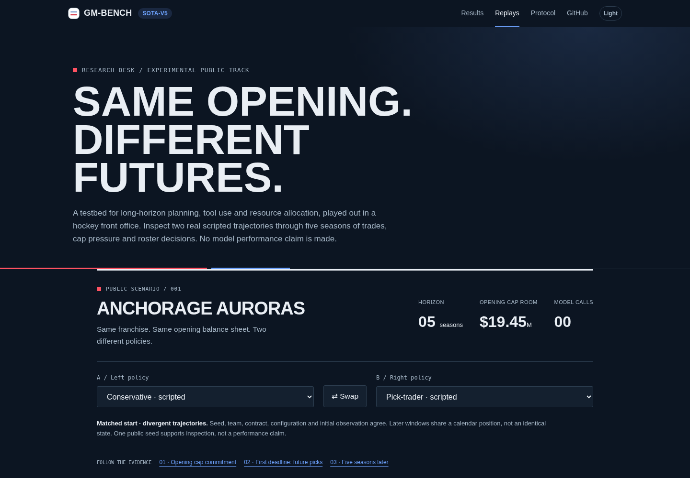
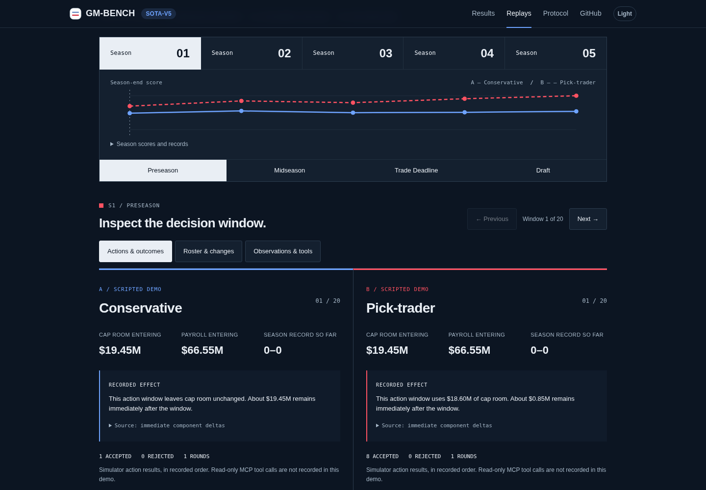
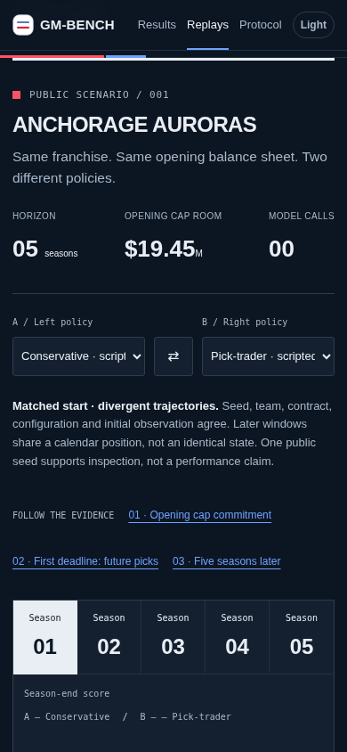
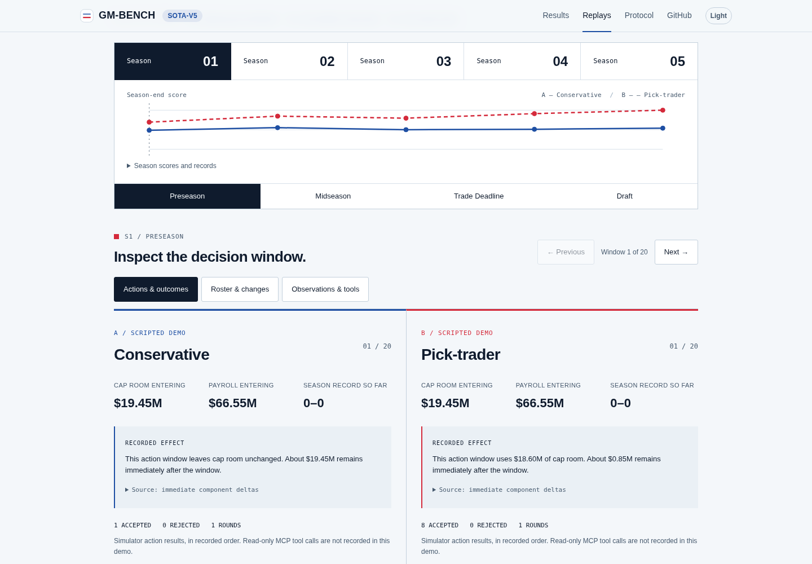

# Public trajectory explorer

The existing `/replays/` page now opens on an experimental, synchronized comparison of two real scripted policies: conservative and pick-trader, both playing Anchorage Auroras on public/dev seed 1 for five seasons. The original conservative replay and Pyodide verifier remain available in the disclosure below the explorer; their fixture is unchanged. The verifier’s stale CDN version now derives from the installed Pyodide loader version.

## Walkthrough

1. Open `/replays/`. Check the matched-start qualification and the two policy selectors. Swap the columns without changing the decision window.
2. Use **Opening cap commitment**: conservative leaves cap room unchanged; pick-trader uses $18.60M in that first window. Expand the source deltas and action arguments/results to inspect the evidence.
3. Use **First deadline: future picks**: inspect the recorded trade, its accepted result, and the immediate future-pick asset delta. This is not a causal claim about the final score.
4. Move between any of five seasons and four phases, or use Previous/Next. Controls work by keyboard. The URL preserves the window, policies and evidence view; browser Back/Forward restores them.
5. Switch to **Roster & changes** or **Observations & tools**. Roster additions/departures compare consecutive opening observations, including simulation between windows. Raw observations are captured at the policy boundary; no MCP retrieval trace or model reasoning is invented.
6. Inspect the final weighted score ledger, provenance hashes, and downloadable JSON. Expand the original replay to use its existing browser verifier.

At mobile widths the two labeled ledgers stack. Roster and score tables scroll within their region without overflowing the page. Native buttons/selects/disclosures provide keyboard controls and visible focus; no hover-only evidence is required.

## Evidence and scientific limits

- This is **one public seed**, not a held-out evaluation or new leaderboard panel. No provider/model calls were made. Scripted policies are labeled everywhere.
- Both policies share seed, team, episode configuration, contract and full initial observation. After acting they occupy different states; a shared calendar does not imply a matched decision-state experiment. Opponent actions and random-number consumption can differ along the trajectories.
- `scripts/build_trajectory_demo.py` uses the real recorder and simulator. It captures the full observation passed to each scripted policy before the recorder's compact presentation conversion, preserves each action round and result, and exports immediate component deltas. No engine, contract or score changes are made.
- Conservative decisions and final state are asserted equal to the existing committed replay. Both action sequences re-simulate and match their final-state digests. Source-package SHA-256 pins an explicit manifest of the root Python modules from the recorded source commit, refusing regeneration if any pinned source changes or disappears. Unrelated new experiment modules do not change this historical source surface or the committed export. Adding a new dependency to the demo requires changing a pinned importer and reviewing the source pin. No historical Git objects or credentials are needed at build time.
- Exact starting-state digest, original replay file SHA-256, source commit/package digest, contract fingerprints and final-state digests are included. Runtime browser validation checks shape, score reconciliation and pair compatibility; it does **not** claim cryptographic verification of the new pair. Python export validation performs both replays. The original Pyodide verifier still verifies only the original conservative fixture.
- Season-summary scores and the final ledger are distinct engine checkpoints: summary scoring precedes appending that summary and advancing season/cap. The final score recomputes after rollover. The UI discloses this. The frozen `recent_wins` component sums the last three **cumulative** season-summary win totals; no scoring correction is introduced here.
- These demos log no MCP tool retrieval trace. Simulator calls and results are shown as such. Logged observations/scouting fields may be inspected, including empty reports. No invented thoughts, causal attribution or fabricated rejected actions are supplied. Both current policies happen to have zero rejected action results.
- Original 1.0 and 2.0 artifacts, panels and scores remain unchanged. Unpinned model/harness results are qualified as exploratory. No counterfactual or memory study is claimed or coupled to this export.
- The complete JSON is about 3.47 MB uncompressed / 0.48 MB gzip. It loads separately from JavaScript. Fetch failures, malformed exports, missing observations, empty data and mismatched pairs have explicit states and no synthetic fallback.

## Reproduce and check

From the repository root, using the project Python environment:

```sh
python3 scripts/build_trajectory_demo.py --check
python3 -m pytest -q
python3 -m ruff format --check gm_bench examples tests scripts web/scripts
python3 -m ruff check gm_bench examples tests scripts web/scripts
python3 -m gm_bench validate-contract
```

From `web/`:

```sh
bun install --frozen-lockfile
bun run lint
bun run build
bunx playwright install --with-deps chromium
bun run test:browser
```

The build checks public-result data, original CPython/Pyodide replay parity, exact offline trajectory regeneration, the trajectory data tests, TypeScript and Vite. Browser tests build and serve the production site (avoiding development-server dependency reloads) and cover all 20 windows in both directions, swaps, browser history/reload, observation/roster/action views, keyboard activation, light/dark WCAG A/AA checks with axe, viewport widths 320/390/768/1440, loading, HTTP errors/retry, malformed/empty/mismatched exports, missing observations and corrupt rendering fields. The retained verifier is also replayed twice in Chromium using installed Pyodide assets served at its exact versioned CDN URL, avoiding a live-CDN dependency in CI. `PLAYWRIGHT_CHROMIUM_EXECUTABLE=/usr/bin/chromium` can select a preinstalled browser.

An independent reviewer inspected the changes. Their shallow-checkout, malformed-data and provenance findings were fixed and regression-tested. Review screenshots below are real Chromium captures of this implementation, not design mockups.

## Screenshots

### Desktop overview



### Desktop evidence desk



### Mobile timeline



### Light theme


